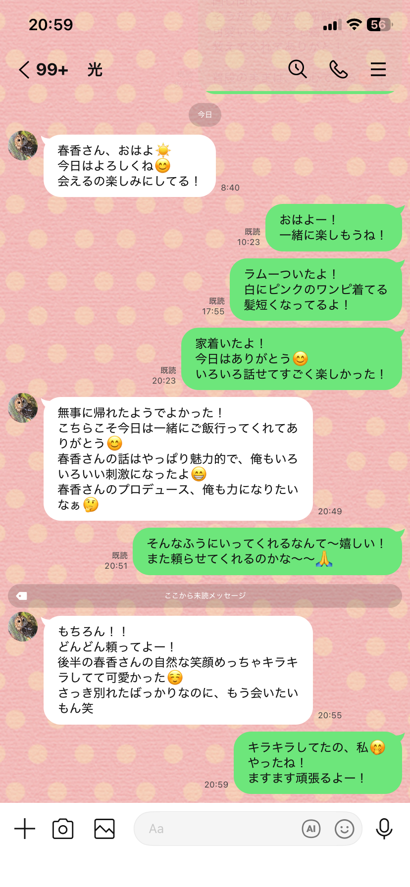

マッチングアプリで知り合ったAとBは3回ほど食事した。
続けてBは何度かAを食事に誘ったが、Aは体調が悪いと数回断り、BからAへの連絡は途絶えた。
Bが約2年後にAにLINEを送り、食事に誘い、Aは応じた。

2025年11月1日、Bは香水をつけており、店を選んで予約、車で送迎、食事代を出す、ドアを開けるを行った。
Bは社内のVBAを担当しており、黒いハリアーに乗っている。
Bの年齢は30~40ぐらい。

食事は庶民的なパスタ店で行われた。

帰りの車で、
A：送迎ありがとう！
B：会ってくれるだけでもう・・・
～
B：Aのことが好きだから付き合って欲しい
A：関東行っちゃうよ？
B：遠距離になるけど付き合って欲しい
A：うーん、そうだね、今回はお断りしておきます
という会話があった。

その日の食事後のLINE会話。

（前の流れ：今日はありがとうと言い合う）
B：Aさんのプロデュース、俺も力になりたいなぁ（絵文字）
A：そんなふうにいってくれるなんて～嬉しい！また頼らせてくれるのかな～～（絵文字）
B：もちろん！！どんどん頼ってよー！後半のAさんの自然な笑顔めっちゃキラキラしてて可愛かった（絵文字）さっき別れたばっかりなのに、もう会いたいもん笑
A：キラキラしてたの、私（絵文字）やったね！ますます頑張るよー！

